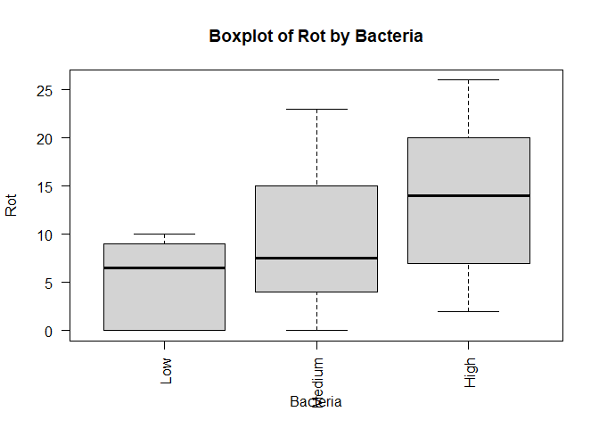
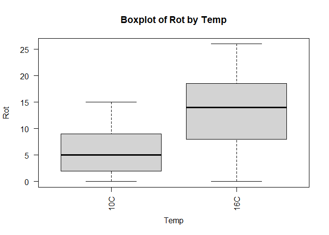
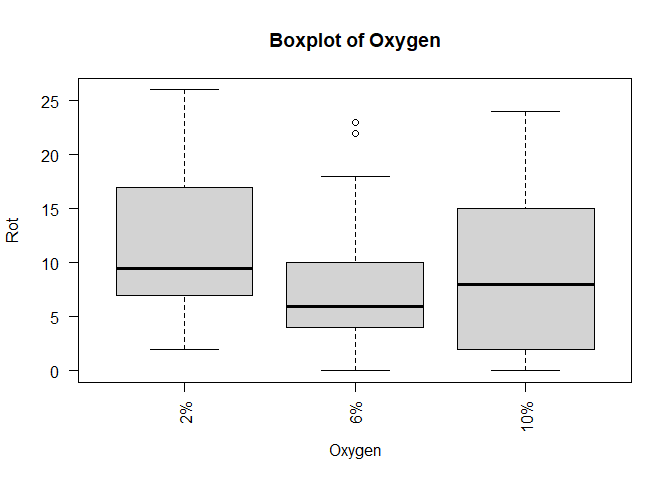
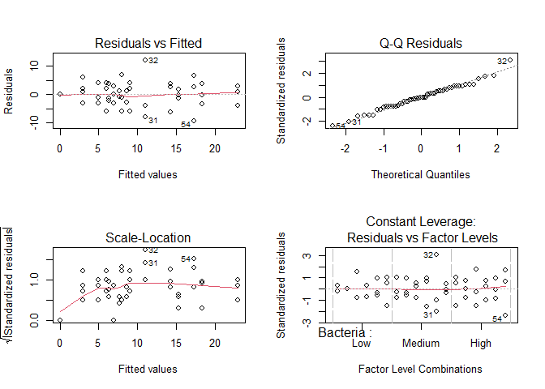
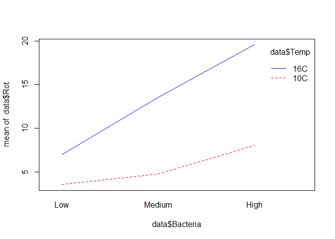
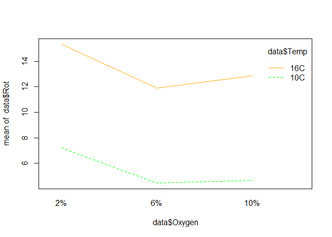

Analysis of one way/two-way classification models
================
Manoj C. Patil
2025-07-12

# **Data: potato.mtw**

The University of Wisconsin conducted a study of potatoes in which
rot-causing bacteria were injected into the potatoes in varying amounts.
The potatoes were left for five days at various temperatures and in
atmospheres with different oxygen contents. The diameter of the rotted
area was measured in mm.

    ## Warning: package 'flextable' was built under R version 4.4.3

<!-- -->

Analyze the data using appropriate design.

### Step 1: Load and Prepare Data

``` r
library('readxl')
```

    ## Warning: package 'readxl' was built under R version 4.4.3

``` r
library(flextable)
# Assuming the data is in a CSV file
data <- read_excel("B1Datasets.xlsx",sheet='Potato')  # Or use read.table()

# Convert factors
data$Bacteria <- factor(data$Bacteria, levels = 1:3, labels = c("Low", "Medium", "High"))
data$Temp <- factor(data$Temp, levels = 1:2, labels = c("10C", "16C"))
data$Oxygen <- factor(data$Oxygen, levels = 1:3, labels = c("2%", "6%", "10%"))
```

### Step 2: Explore the Data

``` r
summary(data)
```

    ##    Bacteria   Temp    Oxygen        Rot        
    ##  Low   :18   10C:27   2% :18   Min.   : 0.000  
    ##  Medium:18   16C:27   6% :18   1st Qu.: 4.000  
    ##  High  :18            10%:18   Median : 8.000  
    ##                                Mean   : 9.407  
    ##                                3rd Qu.:14.750  
    ##                                Max.   :26.000

``` r
#table(data$Bacteria, data$Temp, data$Oxygen)
boxplot(Rot ~ Bacteria , data = data,
        las = 2, main = "Boxplot of Rot by Bacteria")
```

<!-- -->

``` r
boxplot(Rot ~ Temp, data = data,
        las = 2, main = "Boxplot of Rot by Temp")
```

<!-- -->

``` r
boxplot(Rot ~ Oxygen, data = data,
        las = 2, main = "Boxplot of Oxygen")
```

<!-- -->

### Conclusions:

Based on the summary statistics and boxplots, the response variable Rot
varies across the levels of Bacteria, Temp, and Oxygen. The mean Rot is
9.407, with values ranging from 0 to 26. The boxplots suggest that
Bacteria and Temp may have noticeable effects on Rot, as the spread and
median values differ across their levels. For Oxygen, the differences in
Rot appear less pronounced, indicating a potentially weaker effect.
These visualizations suggest that Bacteria and Temp are likely to be
significant predictors, while Oxygen may have a more subtle influence.

### Step 3: Fit Full Factorial ANOVA Model

``` r
# 3-way factorial design
model <- aov(Rot ~ Bacteria * Temp * Oxygen, data = data)
summary(model)
```

    ##                      Df Sum Sq Mean Sq F value   Pr(>F)    
    ## Bacteria              2  651.8   325.9  13.912 3.34e-05 ***
    ## Temp                  1  848.1   848.1  36.202 6.60e-07 ***
    ## Oxygen                2   97.8    48.9   2.088   0.1387    
    ## Bacteria:Temp         2  152.9    76.5   3.264   0.0498 *  
    ## Bacteria:Oxygen       4   30.1     7.5   0.321   0.8621    
    ## Temp:Oxygen           2    1.6     0.8   0.034   0.9666    
    ## Bacteria:Temp:Oxygen  4   81.4    20.4   0.869   0.4921    
    ## Residuals            36  843.3    23.4                     
    ## ---
    ## Signif. codes:  0 '***' 0.001 '**' 0.01 '*' 0.05 '.' 0.1 ' ' 1

### Conclusions:

The ANOVA results indicate that Bacteria (p = 3.34e-05) and Temp (p =
6.60e-07) have highly significant main effects on Rot, suggesting that
these factors strongly influence the response variable. The interaction
between Bacteria and Temp is also significant (p = 0.0498), indicating
that the effect of Bacteria on Rot depends on the level of Temp.
However, Oxygen (p = 0.1387) and its interactions (Bacteria:Oxygen,
Temp:Oxygen, and Bacteria:Temp:Oxygen) are not statistically significant
(p \> 0.05), suggesting that Oxygen does not have a substantial impact
on Rot in this model, nor do its interactions with other factors.

### Step 4: Check Assumptions

``` r
# Residual diagnostics
par(mfrow = c(2, 2))
plot(model)
```

<!-- -->

``` r
# Normality test
shapiro.test(residuals(model))
```

    ## 
    ##  Shapiro-Wilk normality test
    ## 
    ## data:  residuals(model)
    ## W = 0.98401, p-value = 0.6845

``` r
# Homogeneity of variances
library(car)
```

    ## Loading required package: carData

``` r
leveneTest(Rot ~ Bacteria * Temp * Oxygen, data = data)
```

    ## Levene's Test for Homogeneity of Variance (center = median)
    ##       Df F value Pr(>F)
    ## group 17  0.5682 0.8933
    ##       36

### Conclusions: Write some conclusions here

### Step 5: Interpret Significant Effects

``` r
# Use interaction plots to visualize interactions
interaction.plot(data$Bacteria, data$Temp, data$Rot, col = c("red", "blue"))
```

<!-- -->

``` r
interaction.plot(data$Oxygen, data$Temp, data$Rot, col = c("green", "orange", "purple"))
```

<!-- -->

``` r
# If needed, do post-hoc comparisons
library(emmeans)
```

    ## Welcome to emmeans.
    ## Caution: You lose important information if you filter this package's results.
    ## See '? untidy'

``` r
emmeans(model, pairwise ~ Bacteria | Temp * Oxygen)
```

    ## $emmeans
    ## Temp = 10C, Oxygen = 2%:
    ##  Bacteria emmean   SE df lower.CL upper.CL
    ##  Low        7.67 2.79 36    1.999    13.33
    ##  Medium     5.00 2.79 36   -0.667    10.67
    ##  High       9.00 2.79 36    3.333    14.67
    ## 
    ## Temp = 16C, Oxygen = 2%:
    ##  Bacteria emmean   SE df lower.CL upper.CL
    ##  Low        8.67 2.79 36    2.999    14.33
    ##  Medium    14.33 2.79 36    8.666    20.00
    ##  High      23.00 2.79 36   17.333    28.67
    ## 
    ## Temp = 10C, Oxygen = 6%:
    ##  Bacteria emmean   SE df lower.CL upper.CL
    ##  Low        0.00 2.79 36   -5.667     5.67
    ##  Medium     6.33 2.79 36    0.666    12.00
    ##  High       7.00 2.79 36    1.333    12.67
    ## 
    ## Temp = 16C, Oxygen = 6%:
    ##  Bacteria emmean   SE df lower.CL upper.CL
    ##  Low        6.33 2.79 36    0.666    12.00
    ##  Medium    11.00 2.79 36    5.333    16.67
    ##  High      18.33 2.79 36   12.666    24.00
    ## 
    ## Temp = 10C, Oxygen = 10%:
    ##  Bacteria emmean   SE df lower.CL upper.CL
    ##  Low        3.00 2.79 36   -2.667     8.67
    ##  Medium     3.00 2.79 36   -2.667     8.67
    ##  High       8.00 2.79 36    2.333    13.67
    ## 
    ## Temp = 16C, Oxygen = 10%:
    ##  Bacteria emmean   SE df lower.CL upper.CL
    ##  Low        6.00 2.79 36    0.333    11.67
    ##  Medium    15.33 2.79 36    9.666    21.00
    ##  High      17.33 2.79 36   11.666    23.00
    ## 
    ## Confidence level used: 0.95 
    ## 
    ## $contrasts
    ## Temp = 10C, Oxygen = 2%:
    ##  contrast      estimate   SE df t.ratio p.value
    ##  Low - Medium     2.667 3.95 36   0.675  0.7795
    ##  Low - High      -1.333 3.95 36  -0.337  0.9393
    ##  Medium - High   -4.000 3.95 36  -1.012  0.5741
    ## 
    ## Temp = 16C, Oxygen = 2%:
    ##  contrast      estimate   SE df t.ratio p.value
    ##  Low - Medium    -5.667 3.95 36  -1.434  0.3346
    ##  Low - High     -14.333 3.95 36  -3.627  0.0025
    ##  Medium - High   -8.667 3.95 36  -2.193  0.0860
    ## 
    ## Temp = 10C, Oxygen = 6%:
    ##  contrast      estimate   SE df t.ratio p.value
    ##  Low - Medium    -6.333 3.95 36  -1.603  0.2576
    ##  Low - High      -7.000 3.95 36  -1.771  0.1936
    ##  Medium - High   -0.667 3.95 36  -0.169  0.9844
    ## 
    ## Temp = 16C, Oxygen = 6%:
    ##  contrast      estimate   SE df t.ratio p.value
    ##  Low - Medium    -4.667 3.95 36  -1.181  0.4720
    ##  Low - High     -12.000 3.95 36  -3.037  0.0120
    ##  Medium - High   -7.333 3.95 36  -1.856  0.1664
    ## 
    ## Temp = 10C, Oxygen = 10%:
    ##  contrast      estimate   SE df t.ratio p.value
    ##  Low - Medium     0.000 3.95 36   0.000  1.0000
    ##  Low - High      -5.000 3.95 36  -1.265  0.4237
    ##  Medium - High   -5.000 3.95 36  -1.265  0.4237
    ## 
    ## Temp = 16C, Oxygen = 10%:
    ##  contrast      estimate   SE df t.ratio p.value
    ##  Low - Medium    -9.333 3.95 36  -2.362  0.0600
    ##  Low - High     -11.333 3.95 36  -2.868  0.0184
    ##  Medium - High   -2.000 3.95 36  -0.506  0.8689
    ## 
    ## P value adjustment: tukey method for comparing a family of 3 estimates

### Conclusions:

The Shapiro-Wilk test (W = 0.98401, p = 0.6845) indicates that the
residuals of the model are approximately normally distributed, as the
p-value is greater than 0.05, satisfying the normality assumption for
ANOVA. Levene’s test (F = 0.5682, p = 0.8933) suggests that the
variances across groups are homogeneous, as the p-value is well above
0.05. These results confirm that the assumptions of normality and
homogeneity of variances are met, supporting the validity of the ANOVA
results.

### Step 6: Simplify Model (if interactions are not significant)

``` r
# Fit reduced model if interactions are not significant
model_reduced <- aov(Rot ~ Bacteria + Temp + Oxygen, data = data)
summary(model_reduced)
```

    ##             Df Sum Sq Mean Sq F value   Pr(>F)    
    ## Bacteria     2  651.8   325.9  14.102 1.52e-05 ***
    ## Temp         1  848.1   848.1  36.696 2.05e-07 ***
    ## Oxygen       2   97.8    48.9   2.116    0.132    
    ## Residuals   48 1109.3    23.1                     
    ## ---
    ## Signif. codes:  0 '***' 0.001 '**' 0.01 '*' 0.05 '.' 0.1 ' ' 1

``` r
# Compare models
anova(model_reduced, model)
```

    ## Analysis of Variance Table
    ## 
    ## Model 1: Rot ~ Bacteria + Temp + Oxygen
    ## Model 2: Rot ~ Bacteria * Temp * Oxygen
    ##   Res.Df     RSS Df Sum of Sq      F Pr(>F)
    ## 1     48 1109.33                           
    ## 2     36  843.33 12       266 0.9462 0.5144

### Step 7: Report Final Model

``` r
# Final model summary and estimated effects
summary(model)
```

    ##                      Df Sum Sq Mean Sq F value   Pr(>F)    
    ## Bacteria              2  651.8   325.9  13.912 3.34e-05 ***
    ## Temp                  1  848.1   848.1  36.202 6.60e-07 ***
    ## Oxygen                2   97.8    48.9   2.088   0.1387    
    ## Bacteria:Temp         2  152.9    76.5   3.264   0.0498 *  
    ## Bacteria:Oxygen       4   30.1     7.5   0.321   0.8621    
    ## Temp:Oxygen           2    1.6     0.8   0.034   0.9666    
    ## Bacteria:Temp:Oxygen  4   81.4    20.4   0.869   0.4921    
    ## Residuals            36  843.3    23.4                     
    ## ---
    ## Signif. codes:  0 '***' 0.001 '**' 0.01 '*' 0.05 '.' 0.1 ' ' 1

### Conclusions:

The full factorial model reveals that Bacteria and Temp are the primary
factors influencing Rot, with a significant interaction between them.
The non-significant interactions involving Oxygen suggest that it does
not substantially modify the effects of Bacteria or Temp. The model
explains a significant portion of the variance in Rot (based on the Sum
of Squares for Bacteria and Temp), and the significant Bacteria:Temp
interaction indicates that the combined effect of these factors should
be considered when interpreting their impact. For practical
applications, focusing on optimizing Bacteria and Temp levels could
effectively control Rot, while Oxygen levels may be less critical.

# **Data: pancake.mtw**

Data from an experiment designed to study the effects of two factors on
the quality of pancakes. The two factors were the amount of whey and
whether or not a supplement was used. There are four levels of whey and
two levels of supplement giving a total of 4 x 2 = 8 treatment
combinations or cells. Three pancakes were baked using each treatment
combination. Each pancake was then rated by an expert; the three ratings
were averaged to give one overall quality rating. The higher the quality
rating, the better the pancake. This was done three times for each
treatment combination, giving a total of 3 x 8 = 24 overall quality
ratings.

<!-- -->

Analyze the data.

# Analyze the data in **student1.mtw** worksheet in Minitab.

# **ToothGrowth datasets in R** (The Effect of Vitamin C on Tooth Growth in Guinea Pigs)

The response is the length of odontoblasts (cells responsible for tooth
growth) in 60 guinea pigs. Each animal received one of three dose levels
of vitamin C (0.5, 1, and 2 mg/day) by one of two delivery methods,
(orange juice or ascorbic acid (a form of vitamin C and coded as VC). A
data frame with 60 observations on 3 variables.

<!-- -->
